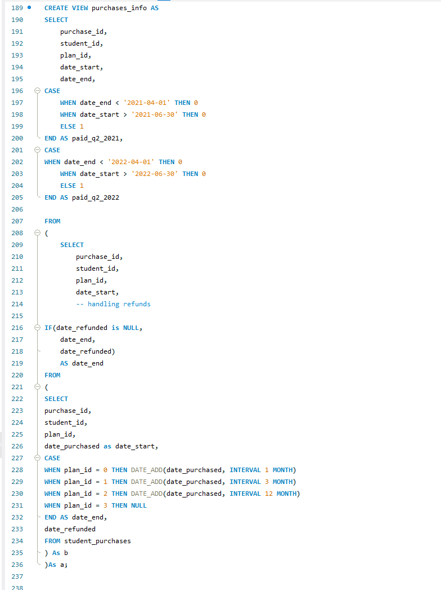
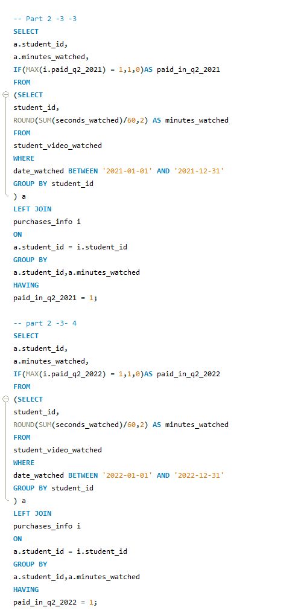
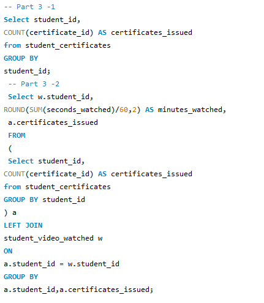
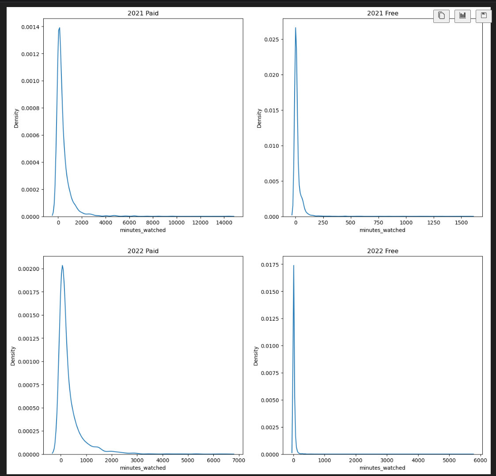
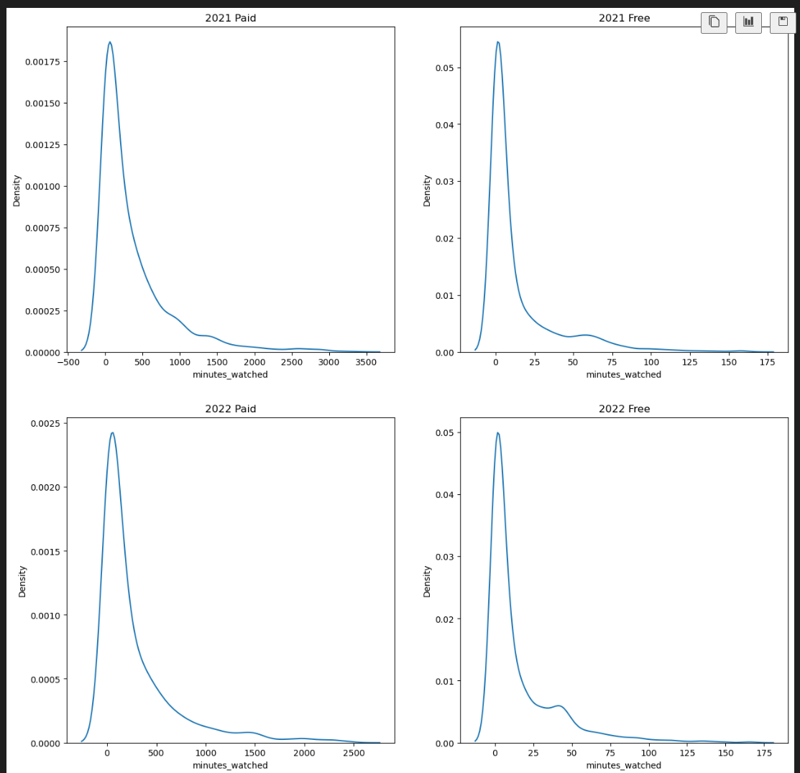
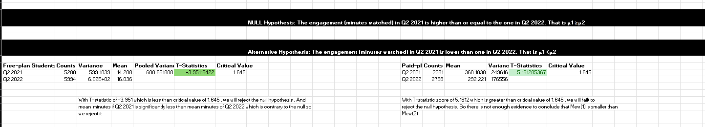
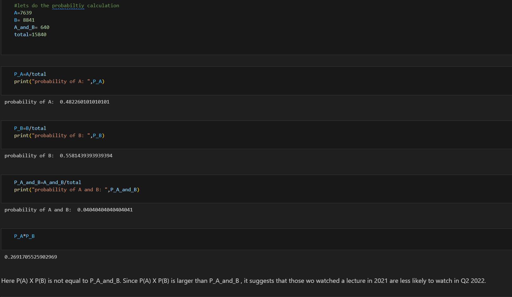
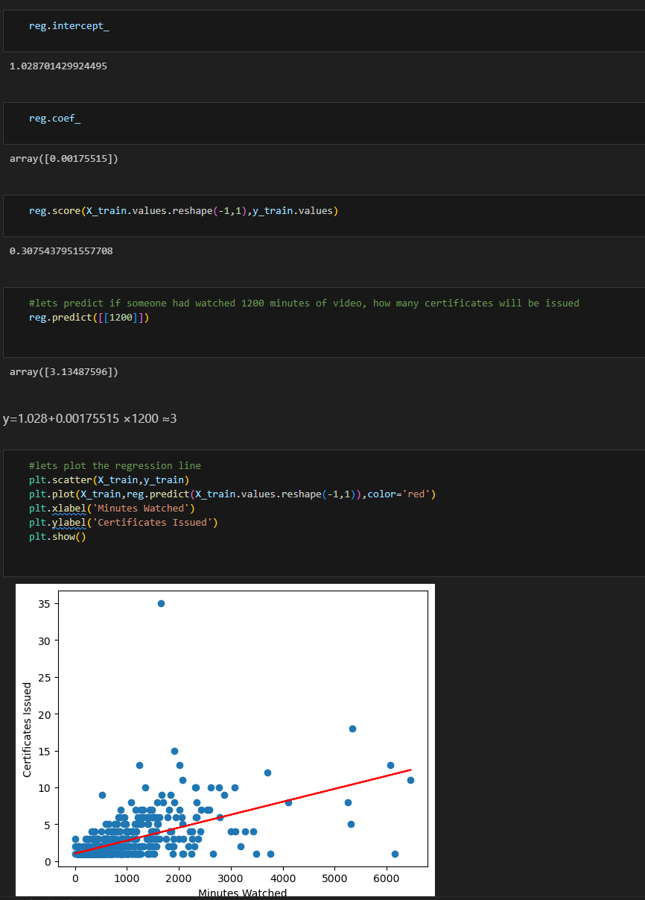

# 📊 Tracking User Engagement — SQL, Excel & Python

A data analytics project examining whether new platform features (career tracks, exams, expanded course library) released in late 2021 increased student engagement on 365 Data Science between **Q2 2021** and **Q2 2022**.

> **Source:** [365 Data Science Career Track Project](https://learn.365datascience.com/projects/tracking-user-engagement-with-sql-excel-and-python/)

---

## Table of Contents
- [Project Overview](#project-overview)
- [Key Findings](#key-findings)
- [Getting Started](#getting-started)
- [Tools & Libraries](#tools--libraries)
- [Methodology](#methodology)
  - [Part 1 – SQL View Creation](#part-1--sql-view-creation)
  - [Part 2 – Splitting Into Periods](#part-2--splitting-into-periods)
  - [Part 3 – Certificates Issued](#part-3--certificates-issued)
  - [Part 4 – Outlier Removal (Python)](#part-4--outlier-removal-python)
  - [Part 5 – Hypothesis Testing (Excel)](#part-5--hypothesis-testing-excel)
  - [Part 6 – Correlation Analysis (Excel)](#part-6--correlation-analysis-excel)
  - [Part 7 – Dependencies & Probabilities](#part-7--dependencies--probabilities)
  - [Part 8 – Predictive Modeling (Python)](#part-8--predictive-modeling-python)
- [Conclusion](#conclusion)

---

## Project Overview

This project investigates student engagement data from a real-world e-learning platform. The analysis spans SQL-based data extraction, Python preprocessing, Excel-based statistical testing, and machine learning prediction — covering the full analytics workflow.

**Hypothesis:**
- **H₀:** No significant difference in engagement between Q2 2021 and Q2 2022
- **H₁:** Engagement in Q2 2022 is higher than in Q2 2021

---

## Key Findings

| Metric | Free-Plan Students | Paid-Plan Students |
|---|---|---|
| Avg. Minutes Watched — Q2 2021 | 14.21 min | 360.10 min |
| Avg. Minutes Watched — Q2 2022 | 16.04 min | 292.22 min |
| t-statistic | -3.95 | 5.16 |
| H₀ Rejected? | ✅ Yes (engagement increased) | ❌ No (engagement declined) |
| Correlation Coefficient | 0.566 (moderate positive) | — |

- New features **boosted engagement for free-plan students** significantly
- **Paid subscribers saw a decline** — warrants further investigation
- A correlation of **0.566** between time watched and platform activity confirms more engaged students are more active overall

---

## Getting Started

### Prerequisites
- Python 3.x
- MySQL Workbench 8.0+
- Microsoft Excel 2007+

### Setup

```bash
# 1. Clone the repository
git clone https://github.com/NirajanKhadka/Tracking-User-Engagement-SQL_EXCEL_PYTHON.git
cd Tracking-User-Engagement-SQL_EXCEL_PYTHON

# 2. Install Python dependencies
pip install pandas matplotlib seaborn statsmodels scikit-learn

# 3. Import the SQL database into MySQL Workbench
# Open MySQL Workbench → Server → Data Import → select provided .sql file

# 4. Run notebooks
jupyter notebook
````

---

## Tools & Libraries

| Tool | Purpose |
|---|---|
| **MySQL** | Data extraction, views, period splitting |
| **Python — pandas** | Data cleaning, outlier removal |
| **Python — matplotlib/seaborn** | Visualization |
| **Python — statsmodels** | Statistical analysis |
| **Python — scikit-learn** | Predictive modeling |
| **Excel** | Hypothesis testing, correlation coefficients |

---

## Methodology

### Part 1 – SQL View Creation

Extracted student purchase, engagement, and certificate data from the platform database. Created SQL views to combine and simplify these tables for downstream analysis.

<p align="center"></p>

---

### Part 2 – Splitting Into Periods

Filtered and aggregated engagement data into two distinct windows:
- **Q2 2021** — Pre-feature release (baseline)
- **Q2 2022** — Post-feature release (comparison)

<p align="center"></p>

---

### Part 3 – Certificates Issued

Extracted certificate issuance records for both periods as a secondary engagement metric — students completing courses and earning certificates reflect deeper platform interaction.

<p align="center"></p>

---

### Part 4 – Outlier Removal (Python)

Removed top 1% outliers (99th percentile cutoff) from all four engagement segments — free/paid × 2021/2022 — to prevent skewed statistical results.

```python
minutes_watched_2021_paid = minutes_watched_2021_paid[
    minutes_watched_2021_paid['minutes_watched'] < percentile_99_2021_paid
]
minutes_watched_2022_free = minutes_watched_2022_free[
    minutes_watched_2022_free['minutes_watched'] < percentile_99_2022_free
]
```

| Before Removal | After Removal |
|---|---|
|  |  |

---

### Part 5 – Hypothesis Testing (Excel)

Used Excel's `T.TEST` function to perform a one-tailed t-test comparing Q2 2021 vs Q2 2022 engagement at α = 0.05.

- **Free-plan:** t = -3.95 < critical value 1.645 → **Reject H₀** (engagement increased)
- **Paid-plan:** t = 5.16 > critical value 1.645 → **Fail to reject H₀** (engagement declined)

<p align="center"></p>

---

### Part 6 – Correlation Analysis (Excel)

Calculated Pearson's correlation between minutes watched and certificates issued using `=CORREL()`.

- **r = 0.566** — moderate positive correlation
- Students who watch more content are meaningfully more likely to complete courses and earn certificates

```excel
=CORREL(A2:A100, B2:B100)
```

---

### Part 7 – Dependencies & Probabilities

Applied conditional probability to assess whether career track enrollment influenced course-watching behavior:

$$P(A \mid B) = \frac{P(A \cap B)}{P(B)}$$

Where **A** = student watched a course, **B** = student enrolled in a career track.

<p align="center"></p>

---

### Part 8 – Predictive Modeling (Python)

Trained a **Random Forest Regressor** to predict future student engagement (minutes watched) based on historical behavior:

- 80/20 train-test split
- Evaluated using **Mean Absolute Error (MAE)**
- Predictions identify students at risk of disengagement for proactive intervention

<p align="center"></p>

---

## Conclusion

The new platform features had a **clear positive impact on free-plan students** but showed an unexpected **decline in paid subscriber engagement**. Key takeaways:

- Free-plan engagement rose from 14.21 → 16.04 avg. minutes (statistically significant)
- Paid-plan engagement dropped from 360.10 → 292.22 avg. minutes
- Moderate correlation (r = 0.566) confirms content consumption drives overall activity
- Future work should investigate **why paid subscribers disengaged** — possible factors include content relevance, UI changes, or feature mismatch with experienced learners